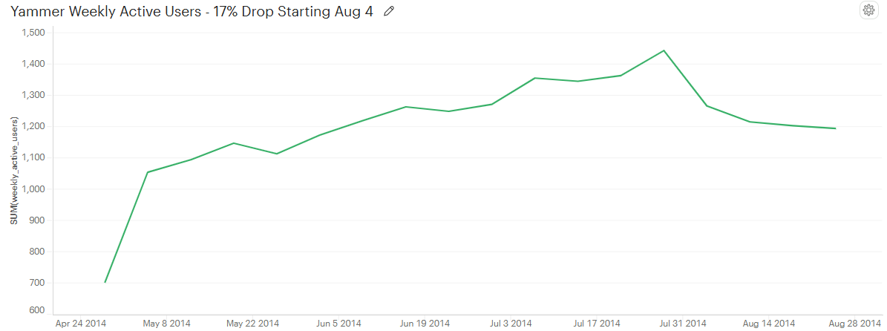
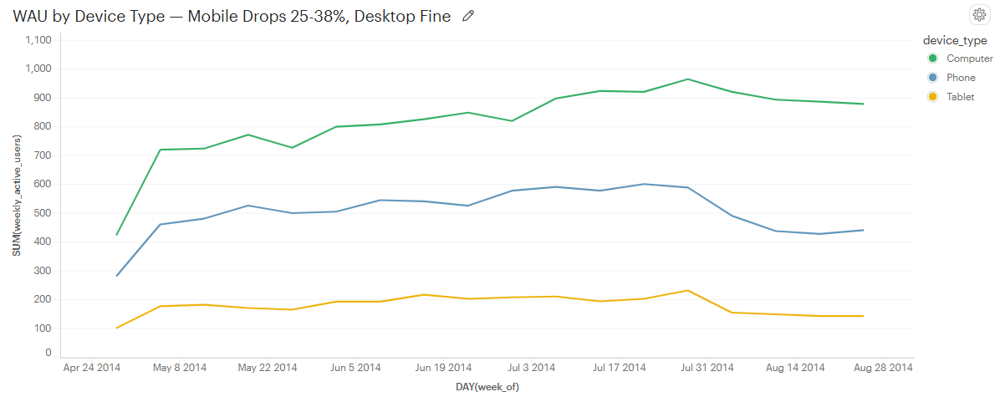
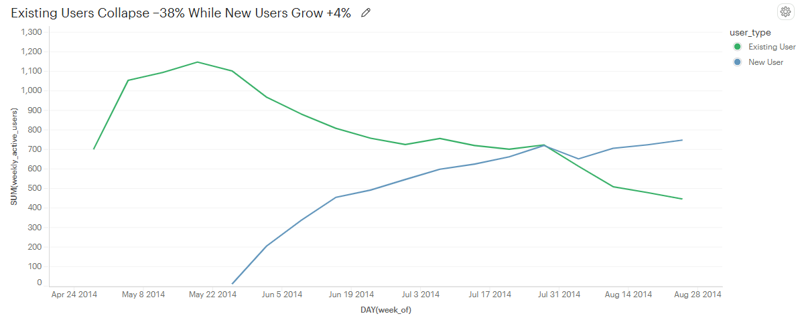
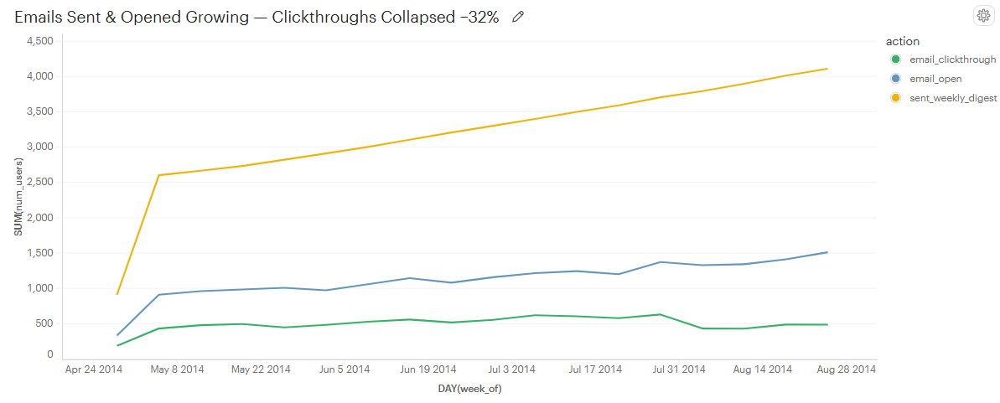
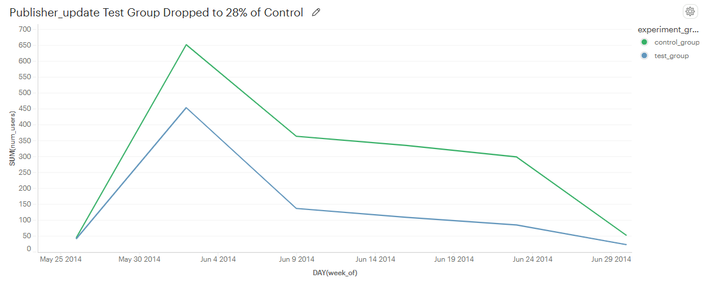

# Yammer WAU Drop - Root Cause Investigation


---

It's August 2014. Yammer's CEO notices Weekly Active Users have been dropping for three weeks straight. Nobody knows why. This is the investigation I ran to find out.

Five queries. Four converging findings. One confirmed root cause.

---

## What I found

WAU peaked at **1,443** on July 28 and dropped to **1,194** four weeks later - a loss of 249 users, or about 17%. The drop wasn't gradual. It was sharp. Something specific happened.



---

## Was it a device problem?

First thing I checked: are we losing users everywhere, or just on certain devices? I bucketed every device into computer, phone, and tablet and tracked each separately.



Computers barely moved down about 9%. Phones dropped 25%. Tablets dropped 38%. Desktop users were completely fine. This wasn't a product-wide problem. It was a mobile problem.

---

## Who exactly were we losing?

Knowing it was mobile still left a big question open: were these long-time users dropping off, or had new signups slowed down? The answer changes everything about how you respond.



New users were actually growing up 4% over the same period. Existing users collapsed 38%. Whatever broke, it only affected people who'd been using Yammer for a while. That ruled out bad press, marketing problems, and broken onboarding all at once.

---

## What about email?

Yammer sends a weekly digest to bring users back to the app. I checked whether something changed in how those emails were performing.



This is where it got interesting. Yammer sent more emails than ever — up 11% from July 28 to August 25. More people opened them too, up 10%. But clickthroughs dropped 32%. Users were reading the digest and choosing not to come back. Or they were clicking and hitting something broken.

Combined with the mobile finding, the picture got clearer: existing users were opening their weekly digest on their phones, clicking through, and landing on a broken mobile experience.

---

## The A/B test that confirmed it

The last piece was the experiments table. Yammer had been running an A/B test called `publisher_update` through June. I wanted to see how the test group performed versus control.



The test group collapsed. By the end of June, test group users were at just 28% of control group engagement. The `publisher_update` feature was clearly hurting the users who received it and when Yammer rolled it out to everyone around July 28, the WAU drop followed immediately.

---

## The short version

```
WAU dropped 17% starting the week of August 4

Mobile users dropped 2-4x harder than desktop users

Existing users fell 38% while new users grew 4%

Email clickthroughs collapsed 32% - opens stayed flat

The publisher_update A/B test showed test users at 28%
of control engagement — rolled out to 100% on July 28
```

A bad feature shipped to mobile. Existing users hit a broken experience when clicking through their weekly digest. They stopped coming back.

---

## What I'd recommend

**Right now:** Roll back publisher_update. Audit the mobile email deep links on iOS and Android. Reproduce the broken clickthrough flow before touching anything else.

**This month:** Fix the mobile experience, then re-ship publisher_update as a proper rollout with monitoring. Run a re-engagement campaign targeting existing users who went inactive after July 28.

**Going forward:** Set an automated alert if weekly digest CTR drops more than 10% week-over-week. That alert would have flagged this problem in week one instead of week four.

---

## Files in this repo

```
yammer-wau-investigation/
├── README.md
├── screenshots/
│   ├── wau_trend.png
│   ├── device_breakdown.png
│   ├── new_vs_existing.png
│   ├── email_analysis.png
│   └── experiments.png
└── queries/
    ├── 01_weekly_active_users.sql
    ├── 02_device_analysis.sql
    ├── 03_new_vs_existing_users.sql
    ├── 04_email_analysis.sql
    └── 05_experiments_analysis.sql
```

Each SQL file has the full query, comments explaining what it does and why, and the actual results embedded at the bottom.

---

## How to run this yourself

You'll need a free Mode Analytics account. Once you're in, connect to the Mode Analytics Training Database and all the `tutorial.yammer_*` tables will be available. Copy any query from the `queries/` folder, paste it in, and run.

---

## SQL concepts used

`DATE_TRUNC` to group events by week, `COUNT(DISTINCT)` to count unique users rather than total actions, `CASE WHEN` to bucket devices into categories, `LEFT JOIN` to bring user signup dates into the events analysis, and `GROUP BY` with full expressions rather than aliases to satisfy PostgreSQL's stricter aggregation rules.

---

Built by **Rohith Reddy Thumma** — Product Analyst, MS Business Analytics @ NAU.

[Portfolio](https://veritas-ui-eight.vercel.app) · [LinkedIn](https://linkedin.com/in/rohithreddythumma) · rohiththumma2001@gmail.com
